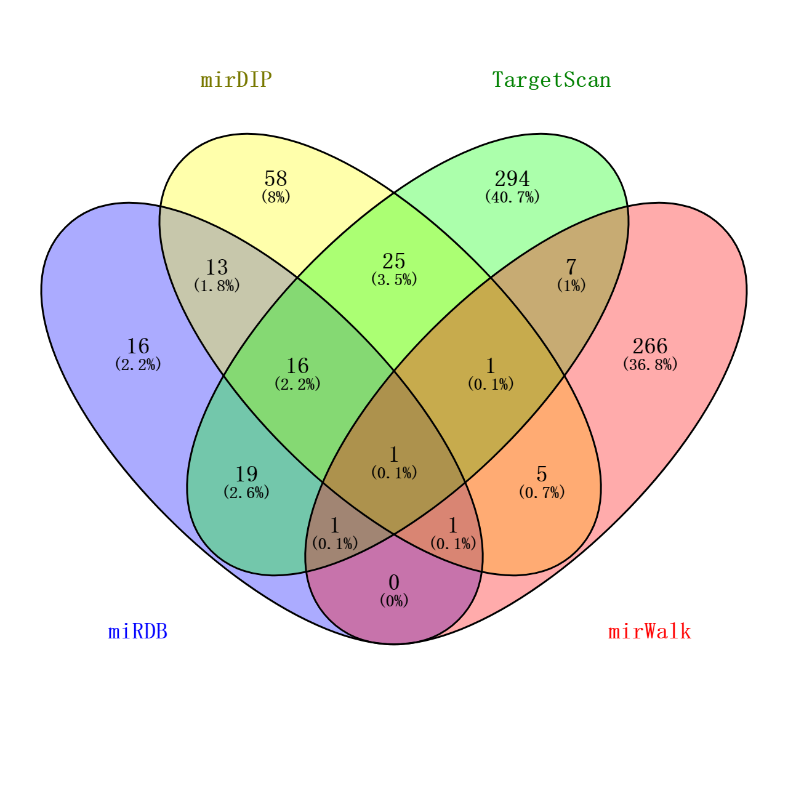

# Gene Weaver
## 基因编织
#### 当前版本：***V 1.6.0***  [更新日志](./update.log)  
######  （使用时尽量使用外置代理，以便更快的采集数据）

---
目录
- 一、[项目简介](#index1)
- 二、[文件结构](#index2)
- 三、[功能详解](#index3)  
  [1.GSE数据集导入](#title1)  
  [2.StarBase查询](#title2)  
  [3.Unlcan查询](#title3)  
  [4.中国知网&PubMed查询](#title4)  
  [5.mirWalk查询](#title5)  
  [6.miRDB查询](#title6)  
  [7.TargetScan查询](#title7)  
  [8.mirDIP查询](#title8)  
  [9.mirDIP查询](#title9)  
  [10.韦恩图交集](#title10)  
- 四、[导出文件](#index4)  
- 五、[配置文件](#index5)
- 六、[Bug相关](#index6)
- 七、[未来开发方向](#index7)
- 八、[声明与感谢](#index8)

## 一、项目简介
  欢迎使用Gene Waver。\
  这是一款基于***python3.9***开发的**完全免费**、**开源**的基因筛查工具，本程序利
  用OCR、计算机爬虫等技术可以实现对StarBase、Ualcan、 mirWalk、mirDIP、miRDB、TargetScan
、TarBase、PubMed、中国知网等多个数据库进行检索，获取相应靶基因信息、差异表达、
生存曲线等信息，从而得出可靠的miRNA -> gene symbol通路。同时程序
还可以生成表格、韦恩图等多种输出形式，亦可在公共服务器上运行。
  

  **适用人群：** 有大批量miRNA检索需求的生信科研人员  
  **项目更新地址：**[https://github.com/zhuerding/gene_weaver](https://github.com/zhuerding/gene_weaver)  
  **安装包下载：**[https://pan.baidu.com/s/1vuHv1Jge21XpvRkUpbk4dw?pwd=5pbl](https://pan.baidu.com/s/1vuHv1Jge21XpvRkUpbk4dw?pwd=5pbl)
## 二、文件结构  
- `./gene_waver.exe`  主程序
- `./database/hsa-lists.csv`  miRNA ID互译表
- `./README.md`  用户手册（markdown语法）
- `./cancer.txt`  癌种代号
- `./test.csv`  测试/体验 GSE数据集
- `./config.ini`  程序配置文件，包含程序运行所需参数  

其余文件为主程序依赖的包，**请勿修改**

## 三、功能详解  
- ### GSE数据集导入  
本程序提供两种导入GSE数据集方式
1. ini配置文件导入  
  在` ./config.ini`文件中的`[base]`模块中米娜桑可以看到`gse = ['','','']`这一行属性值，当GSE数据集位于**本程序所在**的文件夹时米娜桑只需要按照`['xxx.tsv','xxxx.tsv']`的格式 添加数据即可。  
  如果米娜桑的数据集不在**本程序所在**的文件夹时就需要填写绝对路径，例如`['C:\Users\xx\Desktop\xx.tsv','C:\Users\xx\Desktop\xx.tsv`。  
  为避免上一次程序运行时未即时清除配置文件中写入的数据集，故在自动导入时会出现提示，让米娜桑确认是否使用该数据集地址。
所以请不要在使用自动导入功能后直接就去摸鱼，不然程序也会摸鱼的。  
  

2. 手动导入  
  当出现`手动导入数据集模式启动：`提示时 就说明配置文件中没有正确导入或者没有写入数据集地址，此时便要手动导入数据集。  
  手动导入数据集同ini配置导入，当数据集位于**本程序所在**的文件夹时使用相对路径，不在**本程序所在**的文件夹时使用绝对路径。 但是一次只能填写一个，例如：`C:\Users\xx\Desktop\xxx.tsv`或者`xxx.tsv`，输入完成后敲击回车即可。  
  当米娜桑输入完成最后一个数据集地址敲击回车后，可以输入`y`或者`Y`完成导入，至此米娜桑可以开始摸鱼了。  
  
#### **注意事项：**  
  1. 多集导入时GSE数据集请使用 **.tsv** 格式，单集导入可以选择 **.txt**或 **.tsv**格式，并且保证其为 **utf-8**编码格式  
  >编码格式查看可使用windows系统自带记事本软件打开数据集，右下角即为
  > 该tsv文件编码格式，若编码不是utf-8，可以将该文件另存为，在另存为时选择utf-8编码格式。
  
  2. GSE数据集解析分为两种模式  
  - 单集解析  
  单集解析即只导入一个数据集，当导入一个数据集时，**默认** 读取**第一列**的数据，所以请保证单集导入时，第一列数据为米娜桑的miRNA名称（hsa-miR-***格式）。  

  - 多集解析  
  多集解析即导入多个数据集，只要任意两个数据集之间的miRNA存在交集，便会进行查询，此时**默认**读取**第七列**的数据（hsa-miR-***格式）（大多数GSE数据集均第七列为miRNA名称）。  

  此外，请保证GSE数据集**第一行**为标题行，不然无法查询位于第一行的miRNA信息。  

- ### StarBase查询  
  ***此步不需要操作，仅说明原理***  
>Starbase 是通过对高通量的 CLIP-Seq 实验数据和降解组实验数据来搜寻到 micorRNA 靶标，为探讨 microRNA 的靶标提供了各式各样的可视化界面，该数据库容括了丰富的 miRNA-ncRNA、miRNA-mRNA、RBP-RNA 和 RNA-RNA 的数据。

  当成功导入数据集后，程序便会第一个查询StarBase数据库，因为Ualcan数据库相关miRNA信息较少，且服务器位于境外，故本程序不采用Ualacn数据库为筛选数据库。  
  本程序在这一环节中会使用计算机爬虫技术，获取miRNA的差异表达和生存分析曲线的统计学p值，当两个p值**均小于等于**0.05，满足统计学意义时，便进入下一查询环节。  
##### 1.6.0更新：  
  在更新1.6.0版本后，该程序可以自动对StarBase上miRNA的箱式图、生存曲线自动分析，得出该miRNA的性质，并比较两图是否对应。不过，需要**注意**的是，为保证图像质量，程序识别中存在一定的模糊分析，即对比相关数据时会乘以**0.95**或**1.05**的系数，使得Normal组和Cancer组或Low组和High组的图像差异性更加显著。
- ### Ualcan查询  
  ***此步不需要操作，仅说明原理***  
>UALCAN是一个易于使用的，交互式的门户网站，可以执行对TCGA基因表达数据的深入分析。UALCAN使用TCGA level 3 RNA-seq和31种癌症的临床数据。

  当筛选完可用miRNA后，程序便会进一步查询Ualcan数据库，因为Ualcan数据库相关miRNA较少，可能存在只有前体没有成熟体或只有成熟体没有前体的情况，故本程序提供模糊搜索功能，将会根据miRNA名称，自动对其成熟体或前体再次查询，以达到全面获得数据的目的。  
  本程序在这一环节中会使用计算机爬虫技术，获取miRNA的差异表达和生存分析曲线的统计学p值，**无论**两个p值**是否均小于等于**0.05，都会进行记录并标明前体或成熟体。  
- ### 中国知网&PubMed查询  
  ***此步不需要操作，仅说明原理***  
  本程序会使用计算机爬虫技术对这两个数据库进行检索，获取该miRNA的相关文献，并对其进行词云解析。  

        'ACC': ['Adrenocortical Carcinoma', 'ACC', '肾上腺皮质癌'],  
        'BLCA': ['BLCA', 'Bladder Urothelial Carcinoma', '膀胱上皮癌', '膀胱癌', '膀胱尿路上皮癌'],
        'BRCA': ['BRCA', 'Breast Invasive Carcinoma', '乳腺癌', '乳腺浸润癌'],
        'CESC': ['CESC', 'Cervical Squamous Cell Carcinoma and Endocervical Adenocarcinoma', '宫颈癌', '宫颈鳞状细胞癌和宫颈腺癌'],
        'CHOL': ['CHOL', 'Cholangiocarcinoma', '胆管癌', '胆管细胞癌'],
        'COAD': ['COAD', 'Colon Adenocarcinoma', '结肠腺癌', '大肠腺癌'],
        'DLBC': ['DLBC', 'Lymphoid Neoplasm Diffuse Large B-cell Lymphoma', '淋巴肿瘤弥漫性大B细胞淋巴瘤'],
        'ESCA': ['ESCA', 'Esophageal Carcinoma', '食管癌'],
        'HNSC': ['HNSC', 'Head and Neck Squamous Cell Carcinoma', '头颈部鳞状细胞癌', '头颈部鳞癌'],
        'KICH': ['KICH', 'Kidney Chromophobe', '肾嫌色细胞瘤'],
        'KIRC': ['KIRC', 'Kidney Renal Clear Cell Carcinoma', '肾透明细胞癌'],
        'KIRP': ['KIRP', 'Kidney Renal Papillary Cell Carcinoma', '肾乳头细胞癌'],
        'LAML': ['LAML', 'Acute Myeloid Leukemia', '急性髓系白血病', '白血病'],
        'LGG': ['LGG', 'Brain Lower Grade Glioma', '脑低级别胶质瘤', '神经胶质瘤'],
        'LIHC': ['LIHC', 'Liver Hepatocellular Carcinoma', '肝细胞癌', '肝癌'],
        'LUAD': ['LUAD', 'Lung Adenocarcinoma', '肺腺癌'],
        'LUSC': ['LUSC', 'Lung Squamous Cell Carcinoma', '肺鳞状细胞癌'],
        'MESO': ['MESO', 'Mesothelioma', '间皮瘤'],
        'OV': ['OV', 'Ovarian Serous Cystadenocarcinoma', '卵巢浆液性囊腺癌', '卵巢癌'],
        'PAAD': ['PAAD', 'Pancreatic Adenocarcinoma', '胰腺癌'],
        'PCPG': ['PCPG', 'Pheochromocytoma and Paraganglioma', '嗜铬细胞瘤和副神经节瘤', '嗜铬细胞瘤', '副神经节瘤'],
        'PRAD': ['PRAD', 'Prostate Adenocarcinoma', '前列腺癌', '前列腺肿瘤'],
        'READ': ['READ', 'Rectum Adenocarcinoma', '直肠癌'],
        'SARC': ['SARC', 'Sarcoma', '肉瘤', '恶性毒瘤'],
        'SKCM': ['SKCM', 'Skin Cutaneous Melanoma', '皮肤黑色素瘤'],
        'STAD': ['STAD', 'Stomach Adenocarcinoma', '胃癌', '胃腺癌'],
        'TGCT': ['TGCT', 'Testicular Germ Cell Tumors', '睾丸生殖细胞瘤', '睾丸癌'],
        'THCA': ['THCA', 'Thyroid Carcinoma', '甲状腺癌', '甲状腺肿瘤'],
        'THYM': ['THYM', 'Thymoma', '胸腺癌', '胸腺肿瘤'],
        'UCEC': ['UCEC', 'Uterine Corpus Endometrial Carcinoma', '子宫体子宫内膜癌'],
        'UCS': ['UCS', 'Uterine Carcinosarcoma', '子宫癌肉瘤'],
        'UVM': ['UVM', 'Uveal Melanoma', '葡萄膜黑色素瘤']  
***以上为关键词云***  
  我们在词云匹配使用了fuzzywuzzy模块，通过与关键词的匹配度计算degree。  
>  如果在进行关键词云匹配过程中程序终端报错有可能是因为米娜桑的计算机没有安装Visual C++ Build Tools for Visual Studio 2015 with Update 3。  
  <https://my.visualstudio.com/Downloads?q=Visual%20Studio%202015%20update%203&pgroup=>  
  请下载**DVD**版本，如果米娜桑的电脑储存不足，可以在下载后仅安装win10/win7 SDK.

-  当关键词云与相关论文摘要完全匹配时，degree为**Very High**，即有大概率这个miRNA有人做过相关癌种了，你做了大概率被导师骂一顿。  
-  当关键词云与相关论文摘要基本匹配时，degree为**High**，即有一定概率这个miRNA有人做过相关癌种了。  
-  当关键词云与相关论文摘要基本不匹配时（可能有其他癌种有相关研究），degree为**Low**，即有小概率这个miRNA有人做过相关癌种了。  
-  当没有相关论文时，degree为**None**，即基本没人做过这个基因的任何研究。  

  程序会自动对miRNA进行分类，根据米娜桑在配置文件中设置的`model`值进行下一步搜索。
- ### mirWalk查询  
  ***此步不需要操作，仅说明原理***  
>  [miRWalk](http://mirwalk.umm.uni-heidelberg.de/)是一个综合性的miRNA靶基因数据库，收录了Human、Mouse、Rat、Dog、cow等多个物种的miRNA靶基因信息，不仅仅记录了基因全长序列上的miRNA结合位点，也会将其与已有的12个miRNA靶标预测程序（DIANA-microTv4.0 , DIANA-microT-CDS , miRanda-rel2010 , mirBridge , miRDB4.0 , miRmap , miRNAMap, doRiNA i.e.,PicTar2, PITA RNA22v2 , RNAhybrid2.1 and Targetscan6.2 ）的预测结合信息集合进行结合关联。数据库一直在更新收录新的资料，第一版是在2011年发布，之后在2015年发布V2 版本，并登上了Nature methods杂志，目前更新到V3 版本。

  根据米娜桑填写的`model`值，程序会查询mirWalk数据库，程序通过pandas模块对下载到的csv文件进行解析，获取靶蛋白`bindingp` = 1的靶蛋白。  
- ### miRDB查询  
  ***此步不需要操作，仅说明原理***  
>  [miRDB](http://mirdb.org)是用于miRNA目标预测和功能注释的在线数据库。miRDB中的所有目标都由生物信息学工具MirTarget预测，该工具是通过分析来自高通量测序实验的数千个miRNA-目标相互作用而开发的。与miRNA结合和靶点下调相关的共同特征已被确定并用于通过机器学习方法预测miRNA靶点。

  根据米娜桑填写的`model`值，程序会查询miRDB数据库，程序通过xpath模块对页面进行解析，获取靶蛋白`Target Score` > 80的靶蛋白。
- ### TargetScan查询  
  ***此步不需要操作，仅说明原理***  
>  [TargetScan](http://www.targetscan.org/vert_71/) 是一个miRNA 靶基因预测的网站, 包括了 人， 小鼠，果蝇 ， 线虫， 斑马鱼 共5个物种的miRNA 靶基因结果。

  根据米娜桑填写的`model`值，程序会查询TargetScan数据库，程序通过panads模块对下载到的xlsx文件进行解析，获取靶蛋白`Total context++ score` < -0.5 的靶蛋白。  
- ### mirDIP查询  
  ***此步不需要操作，仅说明原理***  
>  [mirDIP](http://ophid.utoronto.ca/mirDIP/index.jsp)集成了30个来源数据库中human相关的靶基因信息，是最全面的人类miRNA靶基因数据库。

  根据米娜桑填写的`model`值，程序会查询mirDIP数据库，程序通过对下载到的tsv文件进行解析，获取靶蛋白`very high`的靶蛋白。
- ### Tarbase查询  
  ***此步不需要操作，仅说明原理***  
>  [TarBase](https://dianalab.e-ce.uth.gr/html/diana/web/index.php?r=tarbasev8)收录各种实验验证过的miR-Target数据（只要是人和小鼠的靶基因信息），TarBase将实验证据分为low和high两类，low代表的是传统的实验手段，可靠性相对于高通量测序的分析结果更高一点，我们可以筛选low方法支持的miRNA靶基因信息，得到高质量的miRNA候选靶基因集。TarBase只提供在线检索，可以输入miRNA名称和/或基因名称，miRNA名称为miRBase数据库格式,基因名称支持gene symbol(基因名)和ensembl gene ID。

  根据米娜桑填写的`model`值，程序会查询Tarbase数据库，程序通过xpath模块对页面进行解析，获取靶蛋白`Score` > 5 的靶蛋白。  
- ### 韦恩图生成  
  ***此步不需要操作，仅说明原理***  
  根据米娜桑填写的`venn`值，程序会将在各个数据库中查询到的高可能性靶蛋白取交集，并生成韦恩图和交集表格。  
  
  
## 四、导出文件   
  本程序具有多种导出文件的能力，因为导出文件较多故单独列出一章节解析。

  导出的文件都位于`./output`文件夹。  
  导出文件夹的命名格式为`电子签名 + 年-月-日 + 时：分：秒 + 癌种 + gene weaver 1.5 output`，例如 ***“zhuerding 22-08-13 13：18：33 ACC gene weaver 1.5 output”***。  
  符合条件基因的生存曲线、差异分析的p值信息以及文献可疑度指数都位于命名格式为`年-月-日 + 时-分-秒 + 癌种.xlsx`的excel文件中。  
  程序运行过程中保存输出的文字信息（方便在程序崩溃后重启）的日志文件位于命名格式为`day年_月_日.log`的.log文件中，可以用记事本打开。
  靶基因信息都位于`./miRNA名`的文件夹内。  
  - `mirWalk.csv`储存了从mirWalk数据库中下载到的靶蛋白数据。  
   - `mirDIP.csv`储存了从mirDIP数据库中下载到的靶蛋白数据。  
   - `TargetScan.xlsx`储存了从TargetScan数据库中下载到的靶蛋白数据。  
   - `miRDB.html`储存了从miRDB数据库下载到的靶蛋白数据，如果有需要米娜桑可以用WPS软件中的表格工具打开（或转为.csv或.xlsx格式）。  
   - `intersection.xlsx`储存了从五个靶蛋白数据中筛选到的所有符合条件的靶蛋白名称。  
   - `/Tarbase`文件夹储存了从Tarbase数据库下载到的靶蛋白数据，因为该数据库似乎没有导出功能，所以下载到的靶蛋白数据会以`页面编号.html`文件的形式储存，有特殊需要如上条所述处理数据。  
   - `/Venn`文件夹储存了程序下载到的韦恩图、交集表格（文字版）、网页界面。  
     - `Venn-miRNA名称.svg`为韦恩图。  
     - `Table-miRNA名称.txt`为交集表格（米娜桑可以用记事本修改为tsv格式使用）。  
     - `Page-miRNA名称.html`为网页界面（米娜桑可以用截图软件截取其中的交集表格）。  

## 五、配置文件  
  本程序提供了一定的自由度，所以配置文件较为复杂……本章会为米娜桑解释配置文件中的参数含义。当然，在配置文件中也有相应的解释。  
   `./config.ini` 为我们的配置文件，其他文件若未在本文档的日后版本中提及，请不要修改。  

- [base]  
  GSE数据集相对或者绝对地址（格式为在[]中加入,'XXX'即可）**(无限制数目)（选填）**  
  - gse = ['','','']  
  查询间隔时间，建议大于0.5s，不需要添加单位 **（单位为s）**  
  - gap = 0.5
  是否生成日志文件，是为1，否为0  
  - log = 1  
  代理服务器ip地址，例如192.168.0.1:80 **（选填）**  
  - proxy =
  是否将输出文件打包成压缩包（方便课题组在服务器上运行后下载），是为1，否为0 **（选填）**  
  - zip = 0  
  电子签名，方便课题组在服务器或公用电脑上运行时标识身份 （选填）(不能出现*:\/?"<>|)  
  - e_name =  
  测试网站是否可以使用，是为1，否为0（启用时加载配置文件需要10s左右）
  - test = 0
- [query]  
    需要miRNA查询的数据库（格式为在[]中加入,'XXX'即可）  
    支持数据库：[StarBase](https://starbase.sysu.edu.cn/)、[Ualcan](http://ualcan.path.uab.edu/analysis.html)  
    因为各方面原因，暂时将starbase数据库作为主数据库，请勿删去’starbase‘（理由详见([2.StarBase查询](#title2)）  
  - db = ['starbase', 'ualcan']  
  需要查询的癌种（请全部使用大写）（目前**仅支持单一**癌种查询）  
  癌种代码详见[./cancer.txt](./cancer.txt)文件  
  - cc = COAD  
  需要文献检索的数据库（格式为在[]中加入,'XXX'即可）  
  支持数据库：[中国知网](https://www.cnki.net/)、[PubMed](https://pubmed.ncbi.nlm.nih.gov/)  
  - paper = ['cnki','pubmed']  
  #需要靶蛋白的数据库（格式为在[]中加入,'XXX'即可）  
  支持数据库：[mirWalk](http://mirwalk.umm.uni-heidelberg.de/)、[TargetScan](https://www.targetscan.org/vert_72/)、[miRDB](http://mirdb.org/)、[mirDIP](https://ophid.utoronto.ca/mirDIP/)、[Tarbase](https://dianalab.e-ce.uth.gr/html/diana/web/index.php?r=tarbasev8)  
  - protein = ['mirdb','mirdip','mirwalk','targetscan','tarbase']
  文献重合度检索，在miRNA文献重合度为某等级以上进行靶基因检索  
  可写参数：4（None）、3（low）、2（high）、1（very high）、0（all）  
  当不填写文献检索数据库且仍需筛查靶基因时，请使用参数0，其他情况不要使用  
  文献重合度界定详情请阅读（[4.中国知网&PubMed查询](#title4)）  
  - model = 3  
  是否生成靶蛋白韦恩图（查询的数据库数**需>=2**），是为1，否为0  
  - venn = 1  
  在靶蛋白搜索时是否保存数据库导出的csv文件，是为1，否为0  
  - save = 1  
  
####    注意事项  
  1. 请不要删去`[base]`、`[query]`、`model = `等这类符号，此为分隔符或参数名。  
  2. 如果米娜桑不小心修改了不该修改的东西，而且不小心保存了，可以选择删除`config.ini`文件，然后运行主程序`gene_weaver.exe`，主程序在检测到配置文件消失后会自动重新生成一份船新的配置文件。  
  3. 在输入参数的时候，所以符号请输入半角（即英文状态下输入），`'`不要用`"`代替，此外不要写一些奇奇怪怪的东西到参数里面，很有可能程序就**瓦塔**了。  
  4. 在程序的更新中会陆续增加新的参数，请在主程序更新后亦更新配置文件，不然新程序可能会罢工……  
  5. 因为很多生信数据库都是免费的，所以其服务器运营压力较大，很有可能突然就噶了，所以最好在程序运行前检查一下网站还能否使用，不然程序也有可能会报错。  
## 六、Bug相关  
####   写在前面  
  程序的开发者是一只**医学牲**，所有python语法都是自学，并未系统性学习过编程，所以出现Bug是意料之外，情理之中……不管怎样，本人会尽可能修复Bug，并维持版本更新~    
***

- 关于出现Bug的说明  
  当程序没有出现`本程序将于XXX秒后自动关闭`或`欢迎使用，按任意键退出程序`这两种提示，都算是出现了Bug，除读取配置文件前的Bug，所有的信息都会被记录在日志文件中。  
  日志文件分为两种，**均**位于主目录`./output/电子签名 + 年-月-日 + 时：分：秒 + 癌种 + gene weaver 1.5 output`。
  - `day年_月_日.log`文件记录了正常运行中所有输出的文字数据，有助于报错后回溯或程序重新运行。  
  - `bug.log`文件记录了程序运行时系统发出的一些信息。  
  
  以上日志文件均可以用**记事本**软件打开，若确认不是因为配置文件中写入了一些奇奇怪怪的东西，就麻烦米娜桑打包**以上两个日志文件**发送标题中带有【BUG】字样的邮件发送至 [zhuerding@zhuerding.top](zhuerding@zhuerding.top) ，如果可以的话希望详细说明发生问题的场景和输入的参数（如果涉及课题组机密，请尽可能用相同的数据脱敏告诉我~）。  
- 因为代理设置导致的问题  
  本程序**推荐**在连接代理的情况下使用，这样可以更快的获取到数据，为避免在没有设置代理的情况下，因访问过慢而失败，本程序设置了多次重新请求的功能，但是如果在出现提示`已查询到X/XXX`或`开始查询XXX`后**30秒**没有出现想要的数据，建议米娜桑`Ctrl+c`主动退出程序重试……  
  如果在挂外置代理的时候出现浏览器可以访问网页，而程序报错的情况，请打开`Clash for windows`左侧栏`setting`下`System Proxy`中的`Specify Protocol`，使其变成绿色。  
  
  [Clash for Windows下载](https://github.com/Fndroid/clash_for_windows_pkg)  
- 其他Bug  
  等待反馈ing
## 七、未来开发方向  
1. 兼容更多的数据库（已在日程的有：[miRcode](http://www.mircode.org/index.php)）
2. 开发更加稳定的程序
3. 某个人正在苦学KEGG和GO，争取下次大更新能实装……  
- 版本计划  
 1.6版本  
  - 加入miRcode、ENCORI等数据库查询功能  
  - 通过CGGA数据库加入HGG（包括GBM）癌种的查询功能  
  - 优化韦恩图绘制功能  
 2.0版本  
  - 正式启用R语言脚本，使得韦恩图绘制、TCGA数据库分析本地化  
  - 加入差异表达、生存分析图像分析功能，使得寻找理想microRNA更加顺利  
 …………  
 3.0版本  
  - 程序进行重构，使得程序完全R语言化，进一步提高分析能力
## 八、声明与感谢  
  程序作者：**zhuerding**（一个**胡桃厨**）  
  本程序遵循**GNU（GNU General Public License）通用公共许可协议**，源代码及其衍生代码的开源且免费使用并可以引用、修改，但不允许修改后和衍生的代码做为闭源的商业软件发布和销售。希望其他基于本程序开发的同学们遵守该协议。  
    这个程序开发过程中感谢**潍坊医学院**黄孟栋同学帮助~  
    以及感谢B站、Github、CSDN一些博主，他们提供的一些代码和思路对这个程序的开发有很大帮助。